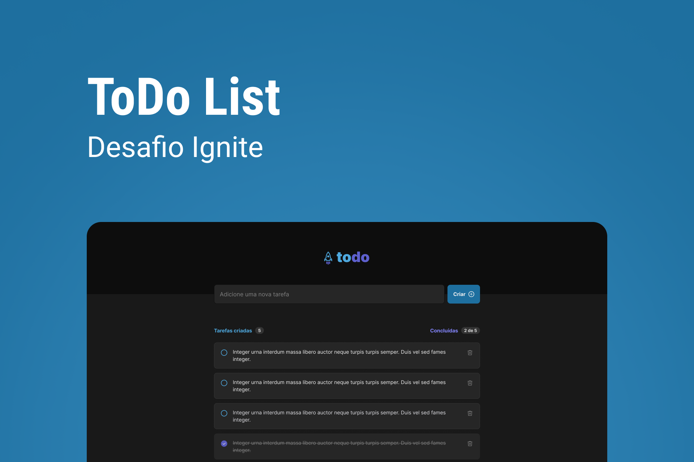

# To Do List (Desafio ignite)

Esse projeto é o primeiro desafio proposto pela [Rocketseat](https://github.com/Rocketseat), na trilha de ReactJS.
Foi muito importante para fixar conhecimentos!

[Link do projeto (Vercel)](https://todo-list-sepia-ten.vercel.app)

## Tecnologias usadas

### Framework
* TypeScript
* ReactJS
### Bibliotecas
* phosphor-react
* uniqid
